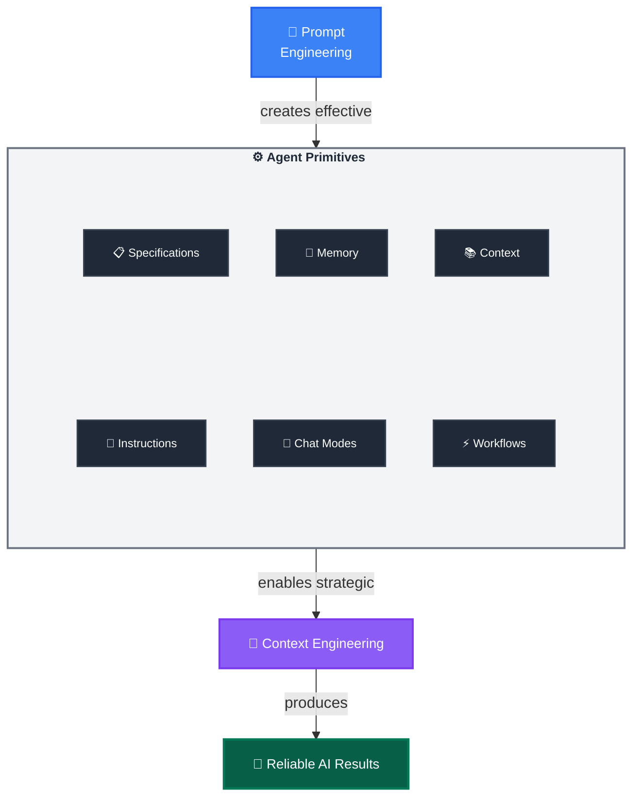

[ARIELLE-spesifikasjonen](../arielle/) definerer fem arkitekturmessige begrensninger for pålitelig AI-native utvikling. Denne guiden viser hvordan du implementerer dem gjennom tre sammenvevde disipliner: strukturert prompting, gjenbrukbare primitiver og strategisk kontekststyring.

Enten du kommer fra spesifikasjonen eller oppdager disse praksisene for første gang, gir mestring av disse disiplinene deg ferdighetene til å gjøre AI-samarbeid pålitelig i skala.

## Hvordan praksisen implementerer ARIELLE

Hver disiplin implementerer konkrete [ARIELLE-begrensninger](../arielle/#the-five-constraints):

| Disiplin | Hva du lærer | ARIELLE-begrensninger |
|------------|----------------|-------------------|
| **Prompt Engineering** | Strukturert naturlig språk-syntaks | Muliggjør alle begrensninger |
| **Agent Primitives** | Gjenbrukbar, komponerbar konfigurasjon | Orchestrated Composition, Safety Boundaries |
| **Context Engineering** | Strategisk styring av kontekstvindu | Progressive Disclosure, Reduced Scope, Explicit Hierarchy |

Disiplinene bygger på hverandre: prompt engineering gir syntaksen, primitiver gjør den gjenbrukbar, og context engineering får den til å skaleres.

## Disiplin 1: Prompt Engineering {#discipline-1-prompt-engineering}
*Muliggjør alle ARIELLE-begrensninger*

**Grunnlaget:** Gjør naturlig språk om til strukturerte, repeterbare instruksjoner ved hjelp av Markdowns semantiske kraft.

**Hvorfor det fungerer:** Markdowns struktur (overskrifter, lister, lenker) veileder AI-tenkningen naturlig og gjør output mer forutsigbar og konsistent.

### Sentrale teknikker

- **Context Loading** *(Progressive Disclosure)*: `[Gjennomgå eksisterende mønstre](./src/patterns/)` – lenker blir kontekstinjeksjonspunkter som henter inn relevant informasjon, enten fra filer eller nettsider
- **Strukturert tenkning**: Overskrifter og punktlister skaper tydelige resonneringsbaner for AI-en å følge
- **Rolleaktivering**: «Du er en ekspert [rolle]» – aktiverer spesialiserte kunndomsdomener og fokuserer svarene
- **Tool Integration** *(Safety Boundaries)*: *Bruk MCP-verktøy `tool-name`* – kobler til deterministisk kodekjøring fra MCP-servere
- **Presisjonsspråk**: Reduser tvetydighet med konkrete, entydige instruksjoner
- **Validation Gates** *(Safety Boundaries)*: «Stopp og innhent brukerens godkjenning» – menneskelig tilsyn ved kritiske beslutningspunkter

### Rask vinner-eksempel

I stedet for: `Find and fix the bug`, bruk:

```markdown
You are an expert debugger, specialized in debugging complex programming issues. 

You are particularly great at debugging this project, which architecture and quirks can be consulted in the [architecture document](./docs/architecture.md). 

Follow these steps:

1. Review the [error logs](./logs/error.log) and identify the root cause. 

2. Use the `azmcp-monitor-log-query` MCP tool to retrieve infrastructure logs from Azure.  

3. Once you find the root cause, think about 3 potential solutions with trade-offs

4. Present your root cause analysis and suggested solutions with trade-offs to the user and seek validation before proceeding with fixes - do not change any files.
```

Når du mestrer strukturert prompting, vil du raskt innse at det er uholdbart å skrive perfekte prompter manuelt for hver oppgave. Det er her den andre disiplinen kommer inn: å gjøre prompt engineering-innsiktene dine om til gjenbrukbare, konfigurerbare systemer.

## Disiplin 2: Agent Primitives {#discipline-2-agent-primitives}  
*Implementerer: Orchestrated Composition · Safety Boundaries*

**Implementeringen:** Komponerbare, avgrensede konfigurasjonsfiler som systematisk tar i bruk prompt engineering-teknikkene dine.

### Kjerneprimitiver

- **Instructions Files** *(Orchestrated Composition)*: Ruller ut strukturert veiledning via modulære `.instructions.md`-filer med målrettet scope
- **Chat Modes** *(Safety Boundaries)*: Ruller ut rollebasert ekspertise via `.chatmode.md`-filer med MCP-verktøybegrensninger som forhindrer sikkerhetsbrudd og tverrdomene-interferens – som faglige lisenser som holder arkitekter fra å bygge og ingeniører fra å planlegge
- **Agentic Workflows** *(Orchestrated Composition)*: Ruller ut gjenbrukbare prompter via `.prompt.md`-filer med innebygd validering
- **Specification Files**: Lager implementeringsklare blåkopier via `.spec.md`-filer som sikrer deterministiske utfall på tvers av menneskelige og AI-eksekutorer
- **Agent Memory Files**: Bevarer kunnskap på tvers av økter via `.memory.md`-filer
- **Context Helper Files** *(Progressive Disclosure)*: Optimaliserer informasjonshenting via `.context.md`-filer

### Transformasjonseffekten

Agent Primitives er de sentrale konfigurerbare elementene som AI Native-utviklere forbedrer iterativt for å sikre pålitelige utfall gjennom systematisk prompt engineering.

**Eksempel på transformasjon:**
- **Teknikk**: «Implementer sikkert brukerautentiseringssystem» (Markdown Prompt Engineering)
- **Primitiver**: Utvikler velger `backend-dev` chat mode → utløser automatisk `security.instructions.md` via `applyTo: "auth/**"` → laster kontekst fra `[Previous auth patterns](.memory.md#security)` og `[API Security Standards](api-security.context.md#rest)` → genererer `user-auth.spec.md` med strukturerte maler → kjører `implement-from-spec.prompt.md`-arbeidsflyt med validation gates (Agent Primitives)
- **Utfall**: Utviklerdrevet kunnskapsakkumulering der du fanger implementeringsfeil i `.memory.md`, dokumenterer vellykkede mønstre i `.instructions.md` og finpusser arbeidsflyter i `.prompt.md`-filer – og skaper sammensatt intelligens som forbedres gjennom din iteratieve raffinering (Context Engineering)

Transformasjonen kan virke kompleks, men legg merke til mønsteret: det som startet som en ad-hoc-forespørsel ble en systematisk arbeidsflyt med tydelige overleveringspunkter, automatisk kontekstlasting og innebygd validering. Hver primitivfil blir en kunnskapsressurs som forbedres med bruk og skaper sammensatt intelligens som tjener hele teamet ditt.

> 💡 **Native VSCode-støtte**: VSCode støtter nativt `.instructions.md`, `.prompt.md` og `.chatmode.md`-filer, men dette rammeverket utvider paradigmet med `.spec.md`, `.memory.md` og `.context.md`-mønstre som representerer grensekonsepter innen AI Native Development.

Når prompter er strukturert og primitiver er satt opp, møter du en ny utfordring: selv de beste promptene og primitivene kan feile når de drukner i irrelevant kontekst eller kjemper om begrenset AI-oppmerksomhet. Den tredje disiplinen adresserer dette gjennom strategisk kontekststyring.

## Disiplin 3: Context Engineering {#discipline-3-context-engineering}
*Implementerer: Progressive Disclosure · Reduced Scope · Explicit Hierarchy*

**Det strategiske rammeverket:** Systematisk styring av LLM-kontekstvinduer for å maksimere agentytelse innenfor minnebegrensninger.

### Hvorfor kontekst betyr noe

LLMer har begrenset oppmerksomhetsspenn, begrenset minne (kontekstvinduer) og glemmer. Strategisk kontekststyring hjelper ikke bare agenter med å fokusere på relevant informasjon, men lar dem komme i gang raskere ved å redusere behovet for å søke etter og ta inn irrelevant eller forvirrende informasjon – og bevarer dermed verdifull kontekstvinduplass og forbedrer pålitelighet og effektivitet.

### Den universelle oppdagelsesutfordringen

Bransjen har utviklet fragmenterte kontekstformater – `.instructions.md` (VSCode), `.cursorrules` (Cursor), `.clinerules` (Cline), `CLAUDE.md` (Claude Desktop) – og låst team til enkeltverktøy. **[AGENTS.md-standarden](https://agents.md)** har vokst frem som den universelle løsningen og er tatt i bruk av over 20 000 åpne kildekode-prosjekter.

**Eksempel på struktur:**
```
project/
├── AGENTS.md                    # Root: project-wide principles
├── frontend/
│   ├── AGENTS.md               # Frontend-specific context
│   └── Button.tsx              # Inherits: root + frontend
└── backend/
    ├── AGENTS.md               # Backend-specific context
    └── auth.ts                 # Inherits: root + backend
```

Agenter går opp i mappestrukturen og laster den nærmeste AGENTS.md-filen – domene-spesifikk kontekst uten global forurensning. Denne hierarkiske tilnærmingen er grunnlaget for skalerbar context engineering.

### Sentrale teknikker

- **Session Splitting** *(Reduced Scope)*: Bruk separate Agent-økter for ulike utviklingsfaser (planlegging → implementering → testing). Fersk kontekst = bedre fokus
- **Modular Rule Loading** *(Progressive Disclosure)*: Skriv `.instructions.md`-filer med `applyTo`-mønstre – presisjonsverktøyet for kontekstlasting. Kompiler til hierarkisk `AGENTS.md` for universell portabilitet
- **Hierarchical Discovery** *(Explicit Hierarchy)*: Agenter går opp mappestrukturen og laster nærmeste AGENTS.md – domene-spesifikk kontekst uten global forurensning. Automatisk kontekstoptimalisering reduserer kontekstsvinn
- **Memory-Driven Development**: Utnytt Agent Memory via `.memory.md`-filer for å opprettholde prosjektkunnskap og beslutninger på tvers av økter
- **Context Optimization** *(Progressive Disclosure)*: Bruk `.context.md` Context Helper Files for å akselerere informasjonshenting og redusere kognitiv belastning
- **Cognitive Focus Optimization** *(Safety Boundaries)*: Bruk chat modes i `.chatmode.md`-filer for å begrense AI-oppmerksomheten til relevante domener

### Praktiske fordeler

- **Session Splitting**: Ferskt kontekstvindu for komplekse oppgaver
- **Modulære instruksjoner + kompilering**: Enkelt sannhetskilde (`.instructions.md`) brukes til å generere portable, optimaliserte kontekstfiler (`AGENTS.md`) automatisk
- **Hierarchical Discovery**: Mindre kontekstforurensning – agenter laster kun relevante instruksjoner for gjeldende fil
- **Memory-Driven Development**: Bevart prosjektkunnskap og beslutningshistorikk over tid
- **Context Optimization**: Raskere oppstartstid og redusert kognitiv belastning
- **Universal Portability**: Samme kontekst fungerer på tvers av GitHub Copilot, Cursor, Codex, Aider og alle store kodeagenter

**Implementering via primitiver:** Hver context engineering-teknikk bruker Agent Primitives strategisk og skaper sammensatte gevinster for kognitiv ytelse.

## Agentic Workflows: alle disipliner i praksis {#agentic-workflows-all-disciplines-in-action}

Nå som du forstår alle tre disiplinene, kan du se hvordan de kombineres i **Agentic Workflows** – komplette, systematiske prosesser som orkestrerer alle primitivene dine til ende-til-ende-løsninger. Disse arbeidsflytene representerer den praktiske anvendelsen av hele rammeverket som fungerer sammen.

**Agentic Workflows** implementeres som `.prompt.md`-filer som koordinerer flere primitiver til samlede prosesser, designet for å fungere enten de kjøres lokalt i IDE-en din eller delegeres til asynkrone agenter.

### Sentrale egenskaper:
- **Full orkestrering**: Kombiner alle tre disipliner (Prompt Engineering + Agent Primitives + Context Engineering) i samlede prosesser
- **Komplett automatisering**: Håndter hele utviklingsoppgaver fra kontekstlasting via implementering til læringsintegrasjon
- **Fleksibel kjøring**: Designet for å fungere enten kjørt lokalt eller delegert til asynkrone GitHub Coding Agents
- **Selvforbedrende intelligens**: Inkluderer læringsmekanismer som oppdaterer primitiver basert på kjøringsutfall

**Kraften i integrasjon:** Det som startet som enkelte teknikker og separate primitivfiler blir en systematisk prosess som håndterer komplette utviklingsoppgaver og kontinuerlig forbedres gjennom bruk. Hver Agentic Workflow er en `.prompt.md`-fil som koordinerer hele AI Native Development-verktøysettet ditt til repeterbare, pålitelige prosesser.

## AI Native Development-rammeverket

<div class="diagram-container" markdown="1">



</div>

**Prompt Engineering + Agent Primitives + Context Engineering = pålitelighet**

## Hovedpoenger {#key-takeaways}

De tre disiplinene implementerer ARIELLE-begrensninger:

1. **Prompt Engineering** gir den strukturelle syntaksen som muliggjør alle begrensninger
2. **Agent Primitives** implementerer Orchestrated Composition og Safety Boundaries via gjenbrukbare, avgrensede filer
3. **Context Engineering** implementerer Progressive Disclosure, Reduced Scope og Explicit Hierarchy via strategisk kontekststyring
4. **Agentic Workflows** kombinerer alle disipliner til komplette, pålitelige prosesser

Sammen skaper disse disiplinene sammensatt intelligens som forbedres gjennom iterativ raffinering.

**Klar for praktisk implementering?** Gå videre til [Kom i gang](../getting-started/) for å bygge dine første Agent Primitives.

**Vil du forstå verktøyøkosystemet?** Hopp til [Verktøy](../tooling/) for kontekstkompilering, pakkehåndtering og produksjonsutrulling.

**Klar for avansert orkestrering?** Hopp til [Agent Delegation](../agent-delegation/) for kjøringsstrategier fra lokal kontroll til asynkron delegering.
